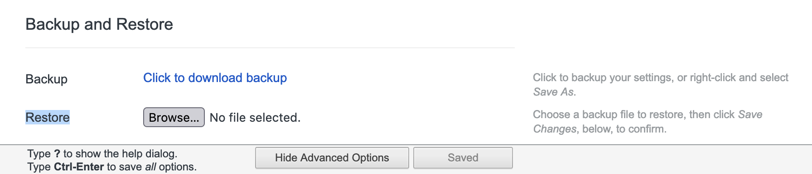

# vimium-options [](https://github.com/psf/black)

My [vimium][vimium] configuration.

[][vimium]

Vimium provides backup and restore functionality that persists its customizable options to a JSON file.

Rather than edit the configuration in the extension's provided options page, the approach used here is to edit files locally, render the changes in vimium's JSON format, then restore the new configuration as if it were a backup.

This makes managing vimium's configuration a little more comfortable.

## Usage

Edit one of the following files with changes.

  - `keyMappings.vim`
  - `searchEngines.properties`
  - `userDefinedLinkHintCss.css`

Render the updated contents of these files as a single JSON file with a local script.

```bash
./local
```

Restore the JSON file on vimium's options page and save changes.



[vimium]: https://github.com/philc/vimium
